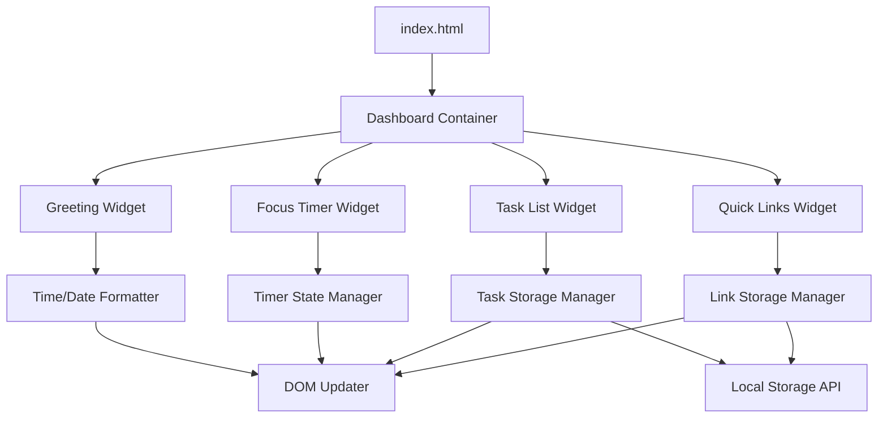

# Design Document: Productivity Dashboard

## Overview

The Productivity Dashboard is a single-page web application built with vanilla HTML, CSS, and JavaScript. It provides four core productivity widgets: a greeting display with real-time clock, a 25-minute focus timer, a task management system, and a quick links manager. All user data is persisted client-side using the browser's Local Storage API, eliminating the need for backend infrastructure.

The application follows a component-based architecture where each widget operates independently with its own state management and DOM manipulation logic. The design prioritizes simplicity, maintainability, and browser compatibility while providing a responsive user experience.

## Architecture

### High-Level Architecture



### Component Architecture

The application is structured into four independent widget modules:

1. **GreetingWidget**: Manages time display and greeting message
2. **FocusTimer**: Manages countdown timer state and controls
3. **TaskList**: Manages task CRUD operations and persistence
4. **QuickLinks**: Manages link CRUD operations and persistence

Each widget follows this pattern:
- State management (internal data structure)
- Business logic (pure functions for transformations)
- DOM manipulation (rendering and event handling)
- Storage interface (serialization/deserialization)

### Technology Stack

- **HTML5**: Semantic markup for structure
- **CSS3**: Styling with flexbox/grid for layout
- **Vanilla JavaScript (ES6+)**: No frameworks or libraries
- **Local Storage API**: Client-side persistence
- **Browser APIs**: Date, setInterval, setTimeout

## Components and Interfaces

### 1. Greeting Widget

**Purpose**: Display current time, date, and time-based greeting

**State**:
```javascript
{
  currentTime: Date,
  updateInterval: number // interval ID
}
```

**Public Interface**:
```javascript
class GreetingWidget {
  constructor(containerElement)
  init()
  destroy()
}
```

**Key Functions**:
- `formatTime(date)`: Returns time string in "HH:MM:SS AM/PM" format
- `formatDate(date)`: Returns date string in "Day, Month DD" format
- `getGreeting(hour)`: Returns greeting based on hour (5-11: morning, 12-16: afternoon, 17-20: evening, 21-4: night)
- `updateDisplay()`: Updates DOM with current time/date/greeting
- `startClock()`: Begins 1-second interval updates

### 2. Focus Timer Widget

**Purpose**: 25-minute countdown timer with start/stop/reset controls

**State**:
```javascript
{
  totalSeconds: number,      // 1500 (25 minutes)
  remainingSeconds: number,  // current countdown value
  isRunning: boolean,
  intervalId: number | null
}
```

**Public Interface**:
```javascript
class FocusTimer {
  constructor(containerElement)
  init()
  start()
  stop()
  reset()
  destroy()
}
```

**Key Functions**:
- `formatTime(seconds)`: Returns "MM:SS" format
- `tick()`: Decrements remainingSeconds by 1, stops at 0
- `updateDisplay()`: Updates DOM with formatted time
- `handleStart()`: Starts interval if not running
- `handleStop()`: Pauses interval
- `handleReset()`: Resets to 1500 seconds, stops interval

### 3. Task List Widget

**Purpose**: CRUD operations for tasks with Local Storage persistence

**State**:
```javascript
{
  tasks: Array<{
    id: string,
    text: string,
    completed: boolean,
    createdAt: number
  }>
}
```

**Public Interface**:
```javascript
class TaskList {
  constructor(containerElement)
  init()
  addTask(text)
  editTask(id, newText)
  toggleTask(id)
  deleteTask(id)
  destroy()
}
```

**Key Functions**:
- `loadTasks()`: Deserializes tasks from Local Storage
- `saveTasks()`: Serializes tasks to Local Storage
- `createTask(text)`: Returns new task object with UUID
- `renderTasks()`: Updates DOM with current task list
- `validateTaskText(text)`: Ensures non-empty text

**Storage Key**: `productivity-dashboard-tasks`

### 4. Quick Links Widget

**Purpose**: CRUD operations for website links with Local Storage persistence

**State**:
```javascript
{
  links: Array<{
    id: string,
    name: string,
    url: string,
    createdAt: number
  }>
}
```

**Public Interface**:
```javascript
class QuickLinks {
  constructor(containerElement)
  init()
  addLink(name, url)
  deleteLink(id)
  openLink(url)
  destroy()
}
```

**Key Functions**:
- `loadLinks()`: Deserializes links from Local Storage
- `saveLinks()`: Serializes links to Local Storage
- `createLink(name, url)`: Returns new link object with UUID
- `validateUrl(url)`: Ensures URL has http:// or https:// protocol
- `renderLinks()`: Updates DOM with current link list

**Storage Key**: `productivity-dashboard-links`

### 5. Application Controller

**Purpose**: Initialize and coordinate all widgets

**Public Interface**:
```javascript
class Dashboard {
  constructor()
  init()
  destroy()
}
```

**Responsibilities**:
- Create widget instances
- Handle application lifecycle
- Coordinate cross-widget interactions (if needed)

## Data Models

### Task Model
```javascript
{
  id: string,           // UUID v4
  text: string,         // Task description (1-500 chars)
  completed: boolean,   // Completion status
  createdAt: number     // Unix timestamp
}
```

### Link Model
```javascript
{
  id: string,           // UUID v4
  name: string,         // Display name (1-100 chars)
  url: string,          // Full URL with protocol
  createdAt: number     // Unix timestamp
}
```

### Local Storage Schema

**Key**: `productivity-dashboard-tasks`
**Value**: JSON array of Task objects

**Key**: `productivity-dashboard-links`
**Value**: JSON array of Link objects

## Correctness Properties

*A property is a characteristic or behavior that should hold true across all valid executions of a system—essentially, a formal statement about what the system should do. Properties serve as the bridge between human-readable specifications and machine-verifiable correctness guarantees.*


### Property 1: Time formatting produces valid 12-hour format

*For any* Date object, formatting the time SHALL produce a string matching the pattern "HH:MM:SS AM/PM" where HH is 01-12, MM and SS are 00-59, and the period is either AM or PM.

**Validates: Requirements 1.1**

### Property 2: Date formatting includes all required components

*For any* Date object, formatting the date SHALL produce a string that contains the day of week name, month name, and day number.

**Validates: Requirements 1.2**

### Property 3: Greeting message matches hour range

*For any* hour value (0-23), the greeting function SHALL return "Good morning" for hours 5-11, "Good afternoon" for hours 12-16, "Good evening" for hours 17-20, and "Good night" for hours 21-23 and 0-4.

**Validates: Requirements 1.3, 1.4, 1.5, 1.6**

### Property 4: Timer formatting produces valid MM:SS format

*For any* non-negative integer representing seconds (0-1500), formatting SHALL produce a string matching the pattern "MM:SS" where MM is 00-25 and SS is 00-59.

**Validates: Requirements 2.6**

### Property 5: Timer reset restores initial state

*For any* timer state (regardless of remaining seconds or running status), calling reset SHALL set remainingSeconds to 1500 and isRunning to false.

**Validates: Requirements 2.4**

### Property 6: Task creation preserves text

*For any* non-empty string, creating a task with that text SHALL produce a task object where the text field equals the input string.

**Validates: Requirements 3.1**

### Property 7: Task editing updates text

*For any* task and any non-empty new text string, editing the task SHALL update the task's text field to the new value while preserving the task's id and createdAt fields.

**Validates: Requirements 3.2**

### Property 8: Task toggle is idempotent

*For any* task, toggling completion status twice SHALL return the task to its original completion state.

**Validates: Requirements 3.3**

### Property 9: Task deletion removes task from list

*For any* non-empty task list and any task ID in that list, deleting the task SHALL produce a new list that does not contain that ID and has length decreased by one.

**Validates: Requirements 3.4**

### Property 10: Task storage round-trip preserves data

*For any* array of valid task objects, serializing to JSON and then deserializing SHALL produce an equivalent array with all task properties preserved (id, text, completed, createdAt).

**Validates: Requirements 3.7**

### Property 11: Link creation preserves data

*For any* valid name string and valid URL string, creating a link SHALL produce a link object where the name and url fields equal the input values.

**Validates: Requirements 4.1**

### Property 12: Link deletion removes link from collection

*For any* non-empty link collection and any link ID in that collection, deleting the link SHALL produce a new collection that does not contain that ID and has length decreased by one.

**Validates: Requirements 4.3**

### Property 13: Link storage round-trip preserves data

*For any* array of valid link objects, serializing to JSON and then deserializing SHALL produce an equivalent array with all link properties preserved (id, name, url, createdAt).

**Validates: Requirements 4.5**

### Property 14: URL validation accepts valid protocols

*For any* string, the URL validator SHALL return true if and only if the string starts with "http://" or "https://".

**Validates: Requirements 4.6**

## Error Handling

### Input Validation Errors

**Task Text Validation**:
- Empty or whitespace-only strings are rejected
- Display user-friendly error message: "Task cannot be empty"
- Maintain current state without modification

**URL Validation**:
- URLs without http:// or https:// protocol are rejected
- Display user-friendly error message: "URL must start with http:// or https://"
- Optionally auto-prepend "https://" if user enters domain only

**Link Name Validation**:
- Empty link names are rejected
- Display error message: "Link name cannot be empty"

### Storage Errors

**Local Storage Quota Exceeded**:
- Catch QuotaExceededError when writing to Local Storage
- Display error message: "Storage limit reached. Please delete some items."
- Prevent data loss by maintaining in-memory state

**Local Storage Unavailable**:
- Detect if Local Storage is disabled or unavailable (private browsing)
- Display warning message: "Storage unavailable. Data will not persist."
- Allow application to function with in-memory state only

**Corrupted Storage Data**:
- Wrap JSON.parse in try-catch
- If parsing fails, log error and initialize with empty array
- Display message: "Could not load saved data. Starting fresh."

### Timer Edge Cases

**Timer at Zero**:
- When countdown reaches 0, stop the interval
- Display "00:00"
- Optionally play notification sound or show alert

**Multiple Start Clicks**:
- Prevent multiple intervals by checking isRunning state
- Ignore start button clicks when timer is already running

### DOM Manipulation Errors

**Missing Container Elements**:
- Check for container element existence in constructor
- Throw descriptive error if container not found
- Fail fast during initialization rather than runtime

**Event Handler Errors**:
- Wrap event handlers in try-catch
- Log errors to console
- Display generic error message to user: "An error occurred. Please refresh."

## Testing Strategy

### Unit Testing

Unit tests will verify specific examples, edge cases, and error conditions for each component:

**Greeting Widget**:
- Specific time formatting examples (midnight, noon, edge hours)
- Boundary cases for greeting ranges (hour 4, 5, 11, 12, etc.)
- Date formatting for month boundaries

**Focus Timer**:
- Initial state verification (1500 seconds)
- Start/stop/reset button interactions
- Timer reaching zero
- Multiple start clicks (should be ignored)

**Task List**:
- Empty task rejection
- Task CRUD operations with specific examples
- Visual differentiation rendering (completed vs incomplete)
- Storage error handling (quota exceeded, corrupted data)

**Quick Links**:
- URL validation edge cases (missing protocol, various formats)
- Link CRUD operations with specific examples
- Storage error handling

### Property-Based Testing

Property-based tests will verify universal properties across all inputs using the **fast-check** library for JavaScript. Each test will run a minimum of 100 iterations to ensure comprehensive coverage.

**Configuration**:
```javascript
// Use fast-check for property-based testing
import fc from 'fast-check';

// Minimum 100 iterations per property test
fc.assert(fc.property(...), { numRuns: 100 });
```

**Test Organization**:
- Each correctness property maps to one property-based test
- Tests are tagged with comments referencing the design property
- Tag format: `// Feature: productivity-dashboard, Property {number}: {property_text}`

**Property Test Coverage**:

1. Time and date formatting properties (Properties 1-3)
2. Timer formatting and state properties (Properties 4-5)
3. Task CRUD and persistence properties (Properties 6-10)
4. Link CRUD and persistence properties (Properties 11-13)
5. URL validation property (Property 14)

**Generators**:
- Random Date objects across full range
- Random hour values (0-23)
- Random second values (0-1500)
- Random task objects with varied text, completion states
- Random link objects with varied names and URLs
- Random URL strings with and without protocols

### Integration Testing

Integration tests will verify component interactions and browser API usage:

**Local Storage Integration**:
- Mock Local Storage API
- Verify save/load operations for tasks and links
- Test storage error scenarios (quota exceeded, unavailable)

**Timer Intervals**:
- Mock setInterval/clearInterval
- Verify interval is created with 1000ms delay
- Verify interval is cleared on stop/reset

**Browser API Integration**:
- Mock window.open for link opening
- Verify correct URL and target parameters

### Manual Testing

Manual testing will verify:
- Cross-browser compatibility (Chrome, Firefox, Edge, Safari)
- Visual design and layout
- Responsive interactions and feedback timing
- Overall user experience

### Test File Structure

```
tests/
  unit/
    greeting.test.js
    timer.test.js
    tasks.test.js
    links.test.js
  property/
    greeting.property.test.js
    timer.property.test.js
    tasks.property.test.js
    links.property.test.js
  integration/
    storage.integration.test.js
    browser-api.integration.test.js
```

## Implementation Notes

### File Structure

```
productivity-dashboard/
  index.html
  css/
    styles.css
  js/
    app.js
  tests/
    (test files as above)
```

### UUID Generation

Use a simple UUID v4 generator or timestamp-based ID:
```javascript
function generateId() {
  return Date.now().toString(36) + Math.random().toString(36).substr(2);
}
```

### Local Storage Keys

- Tasks: `productivity-dashboard-tasks`
- Links: `productivity-dashboard-links`

### Browser Compatibility

Target modern browsers with ES6+ support:
- Chrome 60+
- Firefox 60+
- Edge 79+
- Safari 12+

Use standard APIs only (no polyfills needed for target browsers):
- Local Storage API
- Date API
- setInterval/setTimeout
- JSON.parse/stringify

### Performance Considerations

- Debounce storage writes if needed (currently write on every change)
- Limit task/link list size if performance degrades (suggest 100 items max)
- Use event delegation for dynamic list items
- Minimize DOM reflows by batching updates

### Accessibility Considerations

- Use semantic HTML elements (button, input, ul/li)
- Provide ARIA labels for icon-only buttons
- Ensure keyboard navigation works for all controls
- Maintain focus management for edit operations
- Use sufficient color contrast for completed tasks

### Future Enhancements

Potential features for future iterations:
- Task priorities and categories
- Timer sound notification
- Multiple timer presets (5, 15, 25, 45 minutes)
- Task due dates and sorting
- Export/import data functionality
- Dark mode theme
- Keyboard shortcuts
